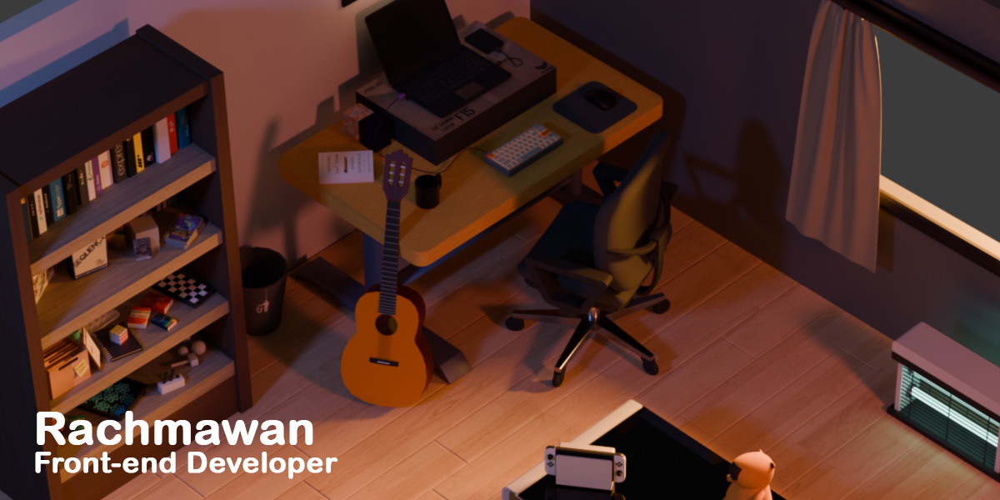

# Personal Portfolio (zeeRoom)

A 3D interactive portfolio built with React, Three.js, and modern web technologies inspired by my real room (about 65% accurate).
It’s more than a website, it’s a digital space that represents me, my work, and my creative process.
 

### ⚙️ Built With

### 🔗 Live Demo

You can check out my portfolio in here:

### ✨ Features

- [x] ~~3D room environment (65% replica of my real setup)~~
- [x] ~~Camera movement & smooth transitions using GSAP logic~~
- [x] ~~Responsive design for mobile and desktop~~
- [x] ~~Add video in project showcase~~
- [x] ~~Add clickable social media logic~~
- [ ] Complete all features camera transition
- [ ] Video optimizaiton
- [ ] Add report bug features
- [ ] Add project showcase
- [ ] Add more HTML UI
- [ ] Add ambient sound and subtle background music
